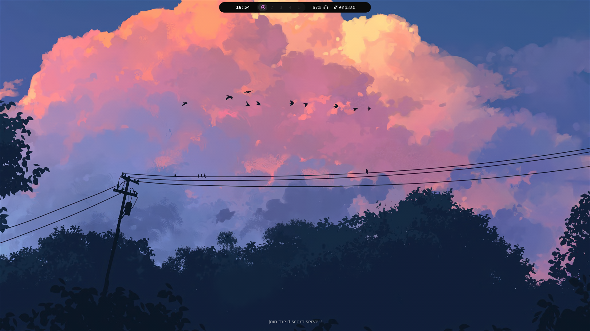
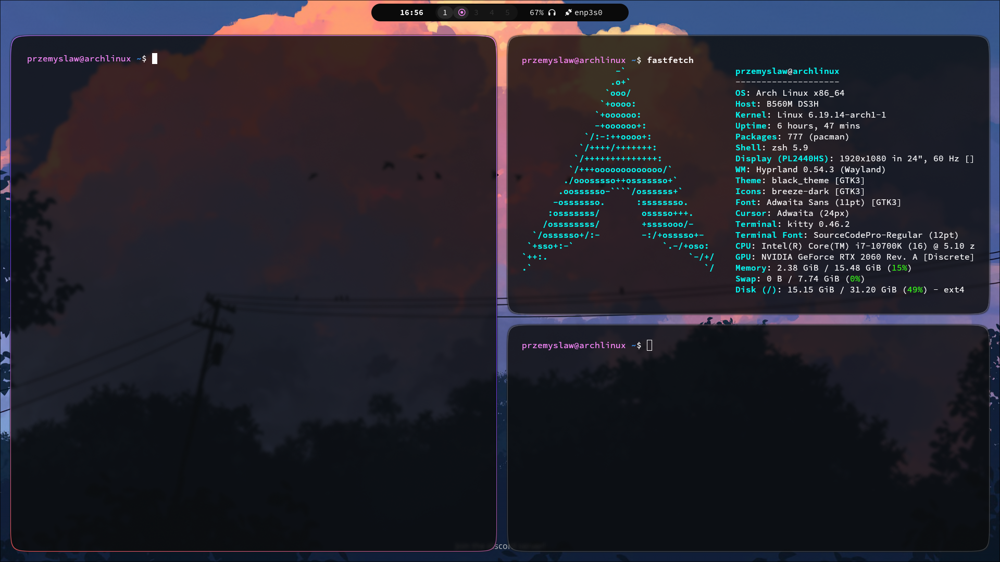
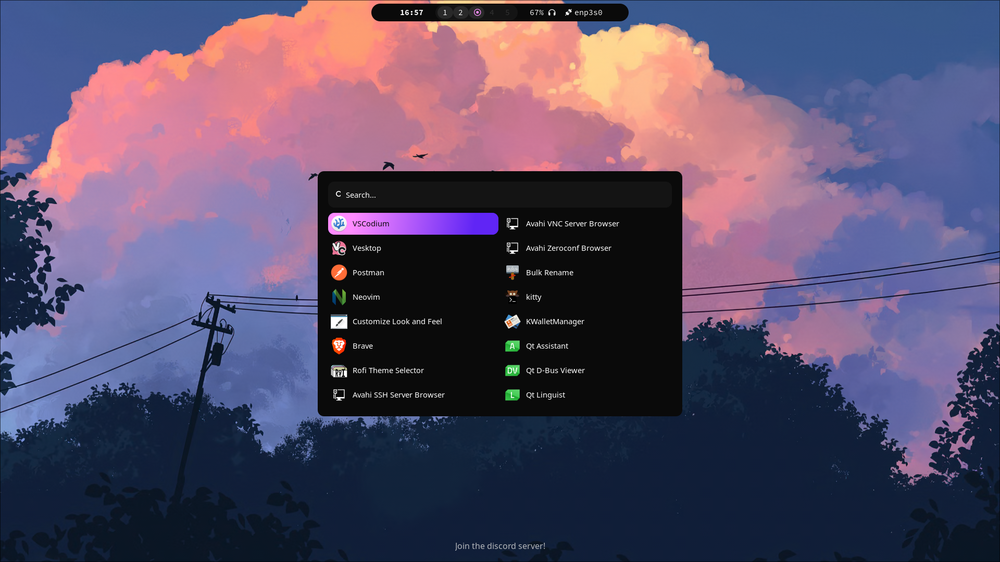
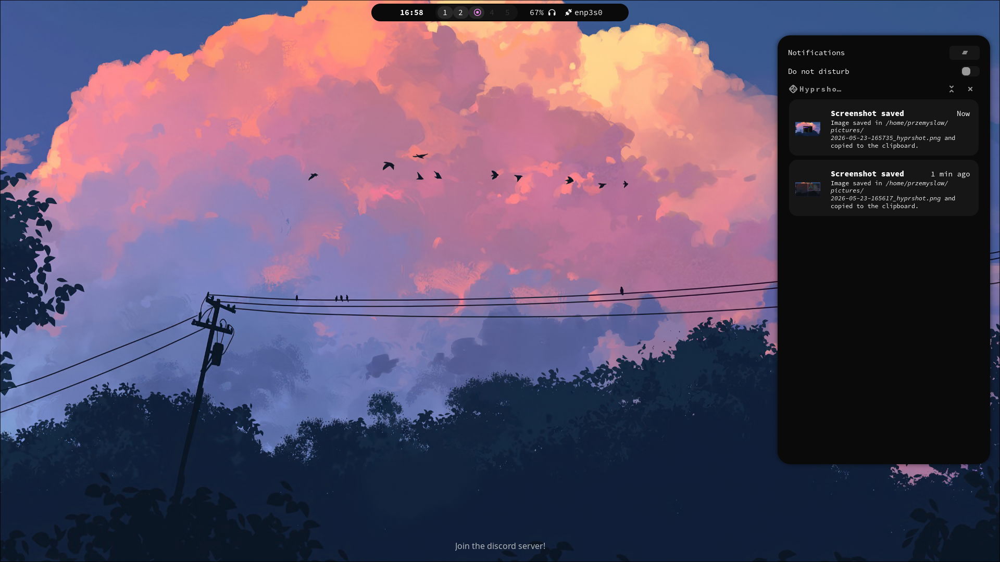

# arch-dotfiles

Minimal Hyprland setup for Arch Linux.

---

## Preview

### Desktop



### Terminal



### Rofi



### Notifications



---

## Components

| Component       | Software       |
| --------------- | -------------- |
| WM              | Hyprland       |
| Bar             | Waybar         |
| Terminal        | Kitty          |
| Launcher        | Rofi           |
| Notifications   | SwayNC         |
| Editor          | Neovim         |
| Visualizer      | Cava           |
| File Manager    | Thunar / XFCE4 |
| Clipboard       | Cliphist       |
| Screenshot Tool | Hyprshot       |

---

## Features

- Minimal dark setup
- Clean Waybar configuration
- Fast Rofi launcher
- Media controls
- Special workspace support
- Simple modular Hyprland config

---

## Keybinds

| Keys                    | Action              |
| ----------------------- | ------------------- |
| `SUPER + Q`             | Open terminal       |
| `SUPER + C`             | Close active window |
| `SUPER + M`             | Exit Hyprland       |
| `SUPER + E`             | Open file manager   |
| `SUPER + X`             | Toggle floating     |
| `SUPER + R`             | Open app launcher   |
| `SUPER + F`             | Open browser        |
| `SUPER + T`             | Toggle fullscreen   |
| `SUPER + N`             | Notification center |
| `SUPER + V`             | Clipboard manager   |
| `SUPER + Print`         | Screenshot monitor  |
| `SUPER + SHIFT + Print` | Screenshot region   |

### Workspaces

| Keys                   | Action                   |
| ---------------------- | ------------------------ |
| `SUPER + 1-0`          | Switch workspace         |
| `SUPER + SHIFT + 1-0`  | Move window to workspace |
| `SUPER + Mouse Scroll` | Cycle workspaces         |

### Window Management

| Keys                  | Action                           |
| --------------------- | -------------------------------- |
| `SUPER + Arrow Keys`  | Move focus                       |
| `SUPER + Left Mouse`  | Move window                      |
| `SUPER + Right Mouse` | Resize window                    |
| `SUPER + S`           | Toggle special workspace         |
| `SUPER + SHIFT + S`   | Move window to special workspace |

### Media Keys

| Keys                    | Action              |
| ----------------------- | ------------------- |
| `XF86AudioRaiseVolume`  | Increase volume     |
| `XF86AudioLowerVolume`  | Decrease volume     |
| `XF86AudioMute`         | Toggle mute         |
| `XF86AudioMicMute`      | Toggle microphone   |
| `XF86MonBrightnessUp`   | Increase brightness |
| `XF86MonBrightnessDown` | Increase brightness |
| `XF86AudioNext`         | Next track          |
| `XF86AudioPrev`         | Previous track      |
| `XF86AudioPlay`         | Play/Pause          |

---

## Installation

Clone the repository:

```bash
git clone https://github.com/przdev7/arch-dotfiles.git
cd arch-dotfiles
```

Copy configs:

```bash
mkdir -p ~/.config

cp -r .config/* ~/.config/
```

Install dependencies:

```bash
sudo pacman -S hyprland kitty waybar rofi neovim cava swaynotificationcenter brightnessctl playerctl wl-clipboard cliphist
```

Optional AUR packages:

```bash
yay -S hyprshot
```

---

## Directory Structure

```text
.
├── .config
│   ├── cava
│   ├── fontconfig
│   ├── hypr
│   ├── kitty
│   ├── nvim
│   ├── rofi
│   ├── swaync
│   ├── waybar
│   └── xfce4
└── README.md
```

---

## Notes

- Designed for Wayland
- Tested on Arch Linux
- Minimal setup focused on speed and usability

---

## Credits

- Hyprland community
- r/unixporn
- Arch Linux Wiki

---

## Author

- [przdev7](https://github.com/przdev7/)
